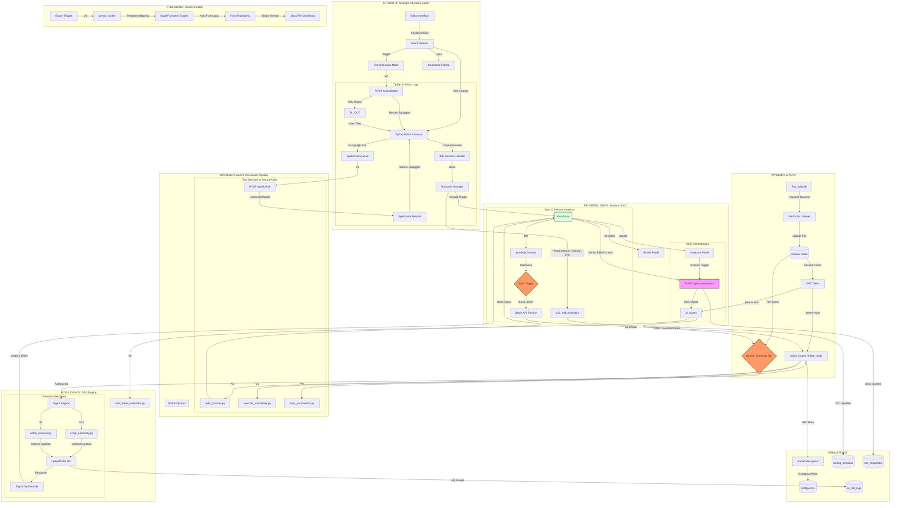

# ARCHITECTURE.md

## Detailed System Simulation & Data Lifecycle

![alt text][def]

---

## What the app does
Inkforge is a high-fidelity narrative asset management suite and publishing pipeline. It goes beyond standard word processing by treating a manuscript as a complex relational database. It integrates an intelligent Story Strategy Optimization (SSO) engine with a distraction-free writing canvas, helping authors maintain structural integrity, consistency, and professional formatting.

## Feature List (Comprehensive)

### Core Editing & Manuscript Management
- **Midnight Chronicle Editor**: A distraction-free, professional three-panel workspace optimized for long-form narrative production.
- **Hierarchical Binder**: Drag-and-drop navigation for Chapters and Scenes with real-time status indicators (Draft, First Pass, Final).
- **Distraction-Free Canvas**: Minimalist writing surface with debounced autosave and native IME composition handling for Indic scripts.
- **Relational Story Bible**: Dedicated trackers for **Characters**, **Locations**, **Timeline Events**, and **Research Notes**, all linked to specific scenes.
- **Relational Lore & Artifacts**: Deep-worldbuilding support via the unified `locations` architecture.

### Intelligence & SSO Engine
- **Prose Analyst**: Real-time analysis of readability, pacing, sentence variety, and passive voice.
- **AI Developmental Editor**: Structural critique and plot consistency checks using project-wide metadata context.
- **Signal Intelligence Pipeline**: Multi-stage AI processing that synthesizes manuscript data into actionable editorial "signals."
- **Inline AI Assist**: Context-aware brainstorming and text expansion available directly within the writing canvas.
- **Script Continuity Guard**: (New) AI-locking mechanism that prevents the SSO engine from drifting to English when analyzing Indic-primary projects.

### Vernacular & India-Market Features (Track A)
- **Indian Genre Template Library**: 12 specialized templates for mythological retelling, masalas, corporate thrillers, etc.
- **Pratilipi-Compatible Export**: Specialized plain-text formatter for leading Indian publishing platforms.
- **Indic Word Counter**: Unicode-aware counter providing per-script breakdowns (Hindi, Kannada, Tamil, Telugu, Latin).
- **Live Transliteration**: Integrated Roman-to-Indic (IAST/HK) transliteration service for seamless typing.
- **Indic Spellcheck**: Backend-powered Hunspell dictionary integration for Hindi and Kannada prose.
- **Noto Font Embedding**: Automated embedding of Indic glyphs in `.docx` exports to prevent "tofu" boxes.

### Monetization & Security
- **Razorpay Tier Gating**: (New) Robust middleware enforcing active premium subscriptions for advanced AI and analysis features.
- **Pro-Tier AI Limits**: Tier-aware token budget enforcement using an Indic-calibrated token estimator.
- **JWT Authentication**: Secure user sessions with Supabase-backed authentication.
- **Environment Isolation**: Conditional mock-auth bypass for rapid local development.

### Infrastructure & Operations
- **StoreSyncManager**: High-frequency debounced batch synchronization daemon for zero-latency data persistence.
- **NovelFormatter Engine**: High-fidelity Python-based `.docx` rendering engine.
- **Writing Goals & Streaks**: Persistent session tracking with timezone-aware streak indicators and daily word goals.
- **Multilingual UI (i18n)**: Full platform localization in English, Hindi, and Kannada.

## Tech stack
- **Frontend**: React 18, Vite, Zustand (SSOT State Management).
- **Backend**: FastAPI (Python 3.10+), Pydantic.
- **Database / Auth**: Supabase (PostgreSQL), JWT.
- **AI Integration**: OpenRouter API for SSO Engine intelligence.
- **Styling**: Vanilla CSS, bespoke Midnight Chronicle theme variables.

## Known issues
- **Sync Overlaps**: Due to the background debouncing mechanism, simultaneous multi-tab/multi-device editing can result in "Last-Write-Wins" collisions.
- **Cold Starts**: If deployed to serverless/free-tier cloud platforms (e.g., Render), the Python backend may experience a ~30-second cold start delay after inactivity.
- **Large Manuscript Export**: Very large manuscripts (>150k words) compiled directly via the backend blob streamer might experience slight memory pressure delays during `.docx` generation.
- **Component Bloat**: `MidnightChronicleEditor.jsx` currently handles a massive amount of internal state and sub-components.

## What you want feedback on
- **Debounce Optimization**: Is the 3-5 second debounce delay in `StoreSyncManager.jsx` optimal for the user experience, or does it feel disjointed during rapid typing sessions?
- **AI Inspector Efficacy**: Are the Prose Analysis and Developmental Editor signals genuinely useful during active drafting, or do they distract from the creative flow?
- **Worldbuilding Abstraction**: Does utilizing the `locations` table to store Lore, Artifacts, and Glossary entries scale well long-term, or should we invest in explicit schema migrations for these specific entities?
- **Component Modularization**: Recommendations on cleanly splitting `MidnightChronicleEditor.jsx` into smaller, highly cohesive files without breaking the tightly coupled Zustand hooks.

[def]: image.png