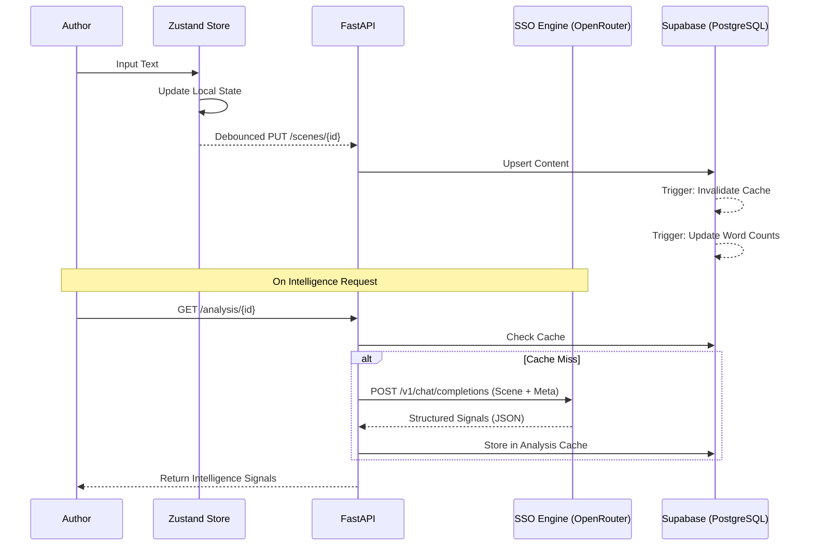

# Author Studio Pro: Technical Specification and Architectural Overview

Author Studio Pro is an advanced, high-fidelity writing suite and publication pipeline designed for the precision management of narrative assets. It provides an integrated environment where creative production is continuously monitored by a Story Strategy Optimization (SSO) engine, ensuring that manuscripts are both artistically consistent and commercially viable according to industry standards.

## 1. Core Purpose and Philosophy

The fundamental problem addressed by Author Studio Pro is the "Semantic Gap" in traditional word processors. Standard tools treat text as a flat sequence of characters. Author Studio Pro treats a manuscript as a complex relational database of interconnected nodes: Scenes, Chapters, Characters, Locations, and Conflict Markers.

By maintaining this structural integrity, the application enables:
- **Real-time Structural Analysis**: The software understands where you are in the story arc.
- **Automated Industry Compliance**: Formatting is a mathematical transformation of data into templates, not a manual stylistic task.
- **Context-Aware Intelligence**: The integrated AI "knows" the entire project bible while you write a single paragraph.

---

## 2. System Architecture

The application implements a decoupled three-tier architecture designed for low-latency feedback and high data integrity.

### 2.1 Frontend: Reactive State Management
- **Framework**: React 18 with Vite for optimized HMR.
- **State Store (Zustand)**: Implements a Single Source of Truth (SSOT) pattern. The store (`storyStore.js`) manages the entire project graph, including nodes (scenes/chapters) and edges (relational links).
- **Synchronization Logic**: A debounced persistence engine (`useAutoSave`) monitors the store and synchronizes deltas to the backend every 2000ms of inactivity, ensuring zero data loss without flooding the API.

### 2.2 Backend: Stateless API Gateway
- **Framework**: FastAPI (Python 3.10+).
- **Orchestration**: The backend acts as a stateless gateway between the frontend, the AI providers (OpenRouter), and the persistent database.
- **Concurrency**: Asynchronous request handling allows for non-blocking analysis pipelines where prose metrics and AI signals are processed in parallel.

### 2.3 Persistence: Relational Story Logic
- **Provider**: Supabase (PostgreSQL).
- **Relational Integrity**: The database enforces strict foreign key constraints between scenes, chapters, and the overarching project.
- **Logic at the Edge**: PostgreSQL triggers are utilized for:
    - **Word Count Aggregation**: Automatically updating chapter and project word counts when a scene is modified.
    - **Cache Invalidation**: Nuking analysis results automatically if the underlying content changes, preventing the presentation of stale data.

---

## 3. The Intelligence Subsystem (SSO Engine)

The Story Strategy Optimization (SSO) engine is a proprietary intelligence layer that synthesizes manuscript data into actionable signals.

### 3.1 Signal Processing
The engine splits analysis into three distinct logical tracks:
- **The Analyst**: Focuses on structural integrity, identifying pacing issues and narrative logic gaps.
- **The Strategist**: Monitors character arc progression and the resolution of conflict markers defined in the story bible.
- **The Ideas Track**: Provides creative synthesis, suggesting thematic connections based on the current scene's proximity to earlier plot points.

### 3.2 Token Window Optimization
To maintain cost-efficiency and performance, the engine employs a "Metadata-First" context injection strategy:
- **Context Compression**: Instead of sending the entire 80,000-word manuscript, the engine sends the active scene's text + a compressed summary of relevant project metadata (character bios, previous scene summaries).
- **RAG-lite Approach**: Relevant story bible entries are injected into the prompt context only when relevant keywords are detected in the active scene.

---

## 4. The Formatting and Distribution Engine

The formatter is a specialized rendering engine that transforms raw manuscript data into production-ready `.docx` files.

### 4.1 Template Transformation
The engine uses a style-mapping architecture:
- **Normalization**: Raw text is stripped of ad-hoc formatting and normalized into a clean internal representation.
- **Style Mapping**: Logical nodes (e.g., "Chapter Title", "Body Paragraph", "Scene Break") are mapped to template-specific styles defined by US/UK Literary Agencies or the WGA.
- **Output Generation**: The final document is rendered server-side using a template-injection process, ensuring 100% compliance with rigid industry standards.

---

## 5. Technical Data Flow

---

## 6. Performance Characteristics and Limitations

- **Latency**: Core write operations are sub-50ms (local) and ~200ms (remote).
- **Cold Starts**: As the backend is hosted on Render, the initial wake-up time for the API can reach 30 seconds after a period of inactivity.
- **Concurrency**: The system is designed for single-author sessions. Simultaneous multi-device editing of the same scene may lead to "Last-Write-Wins" collisions.
- **Context Window**: AI intelligence is optimized for scenes up to 5,000 words. Larger scenes may result in truncated context payloads to ensure stability.

---

## 7. Deployment and Development

### Prerequisites
- **Python 3.10+**
- **Node.js 18+**
- **PostgreSQL (Supabase)**

### Installation
1.  **Repository Setup**: Clone the source and initialize submodules.
2.  **Environment Configuration**: Populate `.env` with `SUPABASE_URL`, `JWT_SECRET_KEY`, and `RAZORPAY_API_KEY`.
3.  **Database Migration**: Execute the scripts in `/supabase/migrations` to initialize the schema, triggers, and stored procedures.
4.  **Service Startup**:
    - Backend: `uvicorn main:app --reload`
    - Frontend: `npm run dev`

---

## 8. Conclusion

Author Studio Pro represents a shift from "Writing Software" to "Writing Intelligence". By combining a design-centric frontend with a relational story engine and an AI-powered optimization layer, it provides authors with the professional tools required for modern, data-driven storytelling.

© 2026 Author Studio Pro. Technical Documentation v3.1.
