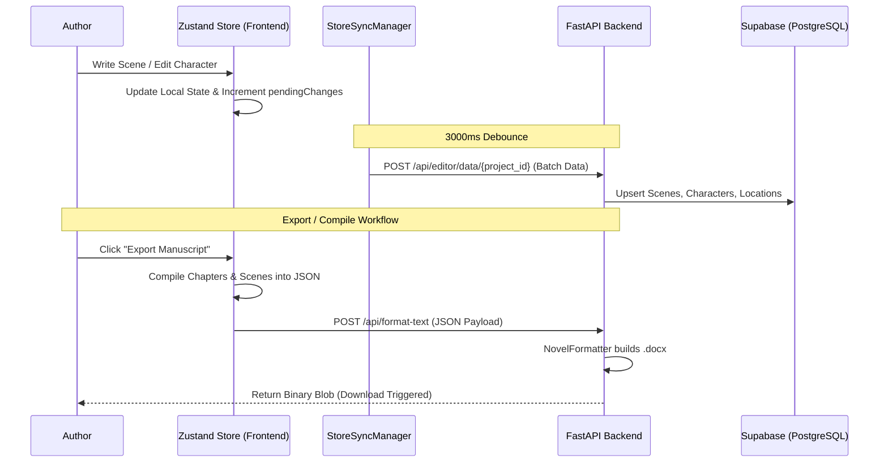

# Author Studio Pro: Technical Specification and Architectural Overview

Author Studio Pro is an advanced, high-fidelity writing suite and publication pipeline designed for the precision management of narrative assets. It provides an integrated environment where creative production is continuously monitored by a Story Strategy Optimization (SSO) engine, ensuring that manuscripts are both artistically consistent and commercially viable according to industry standards.

## 1. Core Purpose and Philosophy

The fundamental problem addressed by Author Studio Pro is the "Semantic Gap" in traditional word processors. Standard tools treat text as a flat sequence of characters. Author Studio Pro treats a manuscript as a complex relational database of interconnected nodes: Scenes, Chapters, Characters, Locations, Lore, Timeline Events, and Research Notes.

By maintaining this structural integrity, the application enables:
- **Real-time Structural Analysis**: The software understands where you are in the story arc.
- **Automated Industry Compliance**: Formatting is a mathematical transformation of data into templates, not a manual stylistic task.
- **Context-Aware Intelligence**: The integrated AI "knows" the entire project bible while you write a single paragraph.

---

## 2. System Architecture

The application implements a decoupled three-tier architecture designed for low-latency feedback and high data integrity, now powered by the highly optimized **Midnight Chronicle Editor** UI.

### 2.1 Frontend: Reactive State Management & Midnight Chronicle Editor
- **Framework**: React 18 with Vite for optimized HMR.
- **State Store (Zustand)**: Implements a Single Source of Truth (SSOT) pattern. The store (`storyStore.js`) manages the entire project graph, including nodes (scenes/chapters), metadata (characters, worldbuilding), and edges (relational links).
- **The Midnight Chronicle Layout**: A professional, icon-free, highly focused three-panel interface:
    - **Binder Panel**: Handles chapter and scene ordering, drag-and-drop navigation, and content hierarchy.
    - **Writing Canvas**: Distraction-free text editing with inline AI assistance and syntax tracking.
    - **Inspector Panel**: Dynamic sidebar housing contextual character info, prose analysis, AI developmental editor feedback, and scene version history.
- **Synchronization Logic (`StoreSyncManager.jsx`)**: A debounced background synchronization daemon monitors the `pendingChanges` state within the Zustand store. Whether updating a scene's text, or modifying a character's traits, the manager batches all updates and synchronizes them to the backend API every few seconds, guaranteeing zero data loss.

### 2.2 Backend: Stateless API Gateway
- **Framework**: FastAPI (Python 3.10+).
- **Orchestration**: The backend acts as a stateless gateway connecting the React frontend to the Supabase database and external AI providers (OpenRouter).
- **Batch Metadata Processing**: The backend features unified batch endpoints (e.g., `POST /api/editor/data/{project_id}`) which efficiently bulk-upsert entire arrays of characters, locations, and scenes in single database transactions to minimize network latency.
- **Format Rendering**: The backend parses chapter-scene hierarchies and transforms them into native `.docx` formats via the `NovelFormatter` engine, streaming the binary blob securely back to the frontend.

### 2.3 Persistence: Relational Story Logic
- **Provider**: Supabase (PostgreSQL).
- **Relational Integrity**: The database enforces strict foreign key constraints across `projects`, `chapters`, `scenes`, `characters`, `locations`, `timeline_events`, and `research_notes`.
- **Dynamic Schema Utilization**: To prevent database schema bloat, Worldbuilding components like "Glossary", "Lore", and "Artifacts" are elegantly mapped onto the unified `locations` table using a robust `type` categorization index. This ensures all worldbuilding data remains perfectly in sync without schema drift.

---

## 3. The Intelligence Subsystem (SSO Engine)

The Story Strategy Optimization (SSO) engine is a proprietary intelligence layer that synthesizes manuscript data into actionable signals.

### 3.1 Signal Processing
The engine splits analysis into distinct logical tracks available in the **Inspector Panel**:
- **Prose Analyst**: Evaluates readability, pacing, sentence variety, passive voice detection, and overused word tracking.
- **AI Developmental Editor**: Flags structural weaknesses, suggests scene transitions, critiques pacing, and checks plot consistency by dynamically pulling context from the active chapter.

### 3.2 Token Window Optimization
To maintain cost-efficiency and performance, the engine employs a "Metadata-First" context injection strategy:
- **Context Compression**: Instead of sending the entire 80,000-word manuscript, the engine sends the active scene's text alongside a compressed summary of relevant project metadata.
- **RAG-lite Approach**: Relevant story bible entries (characters, lore, timeline) are injected into the prompt context only when relevant entities are mapped.

---

## 4. The Formatting, Export, and Distribution Pipeline

The formatter is a specialized rendering engine that transforms raw manuscript data into production-ready `.docx` files, fully integrated into the frontend client.

### 4.1 Client-Side Compilation Engine
- The `useExport` hook inside `MidnightChronicleEditor.jsx` acts as a localized compilation engine. It parses the active `chapterOrder`, retrieves the content of chapters or assembles the chapter dynamically from its nested scenes (automatically injecting standard `***` scene breaks).
- It generates a unified `FormatTextRequest` JSON payload directly from the local Zustand store state, eliminating the need for redundant backend queries.

### 4.2 Template Transformation via `NovelFormatter`
- **Normalization**: Raw text is stripped of ad-hoc formatting and normalized into a clean internal representation on the backend.
- **Style Mapping**: Logical nodes are mapped to predefined template specs (e.g., US Standard Manuscript Format, UK Standard).
- **Blob Delivery**: The backend returns the raw `.docx` as a binary Blob stream. The frontend API (`fetchBlob`) captures this stream, creates a secure temporary local Object URL, and programmatically triggers a direct browser download.

---

## 5. Technical Data Flow

---

## 6. Performance Characteristics and Limitations

- **Latency**: Local Zustand state updates are instantaneous (sub-1ms). Backend debounced sync requests resolve in ~100-300ms depending on payload size.
- **Blob Streaming Memory Restrictions**: The backend compiles `.docx` files in memory and streams them directly. While optimized for novels up to 200,000 words, extreme datasets may require pagination.
- **Authentication Bypass**: During local development, the system falls back to a "Demo User" profile (`00000000-0000-0000-0000-000000000000`) ensuring development environments don't crash when offline or without active Supabase session tokens.
- **Cold Starts**: As the backend is hosted on Render, the initial wake-up time for the API can reach 30 seconds after a period of inactivity.

---

## 7. Deployment and Development Configuration

### Prerequisites
- **Python 3.10+** (Backend API & Intelligence)
- **Node.js 18+** (React 18 Frontend)
- **PostgreSQL (Supabase)**

### Installation & Initialization
1.  **Repository Setup**: Clone the repository and initialize submodules.
2.  **Environment Configuration**: Populate `.env` with `VITE_SUPABASE_URL`, `VITE_SUPABASE_ANON_KEY`, and backend keys (e.g., `OPENROUTER_API_KEY`).
3.  **Database Migration**: 
    - Execute `supabase_production_setup.sql` in your Supabase SQL Editor to initialize all tables (`projects`, `chapters`, `scenes`, `characters`, `locations`, `timeline_events`, `research_notes`).
    - Execute `backend/seed_demo.sql` to populate the default development account.
4.  **Service Startup**:
    - Backend: Execute `start-backend.bat` (runs `uvicorn main:app --reload`).
    - Frontend: Execute `start-frontend.bat` (runs `npm run dev`).

---

## 8. Conclusion

Author Studio Pro represents a paradigm shift from simple "Writing Software" to a unified "Writing Intelligence Engine". By abandoning the flat-text model in favor of a relational story graph, and integrating a design-centric reactive frontend with a heavy-lifting Python formatting backend, it provides authors with an uncompromising, professional environment for modern, data-driven storytelling.

© 2026 Author Studio Pro. Technical Documentation v4.0.
